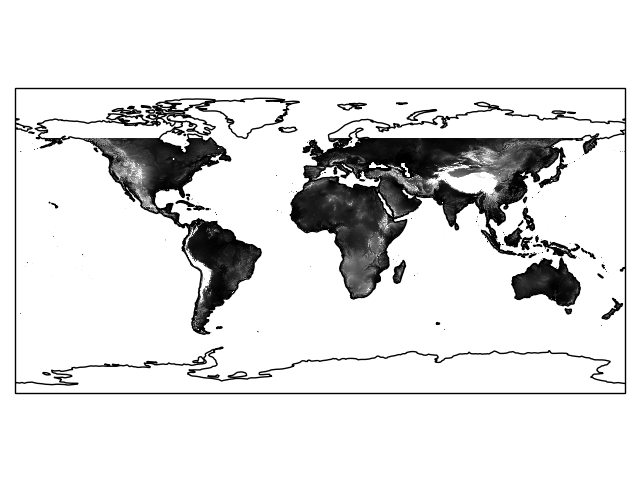
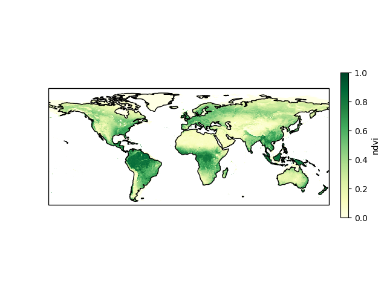
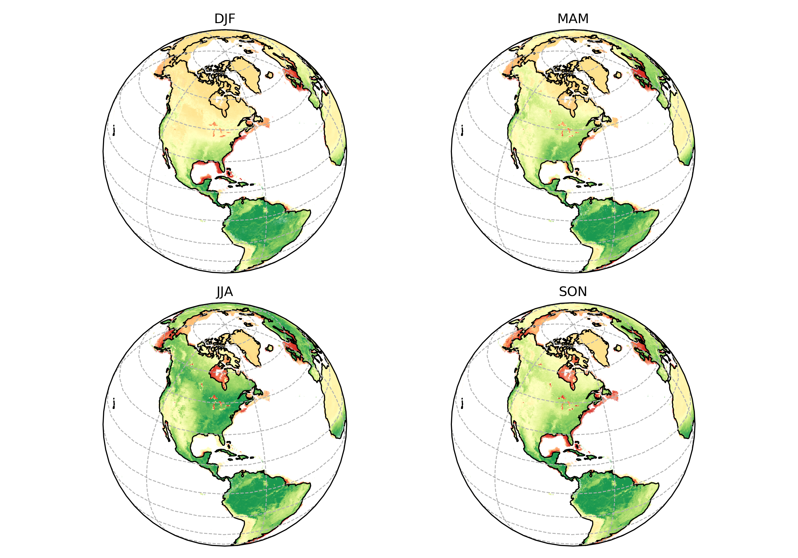

# cartoee
Publication quality maps using [Earth Engine](https://earthengine.google.com/) and [Cartopy](https://scitools.org.uk/cartopy/docs/latest/)!


### Installation
`cartoee` is available to install via `pip`. To install the package, you can use pip  install for your Python environment:

```
pip install cartoee
```

Or, you can install the package manually from source code using the following commands:

```
git clone https://github.com/kmarkert/cartoee.git
cd cartoee
pip install -e .
```


### Working with cartoee
`cartoee` aims to do only one thing well: getting processing results from Earth Engine into a publication quality mapping interface. `cartoee` simply gets results from Earth Engine and plots it with the correct geographic projections leaving `ee` and `cartopy` to do more of the processing and visualization.

#### A simple case

Here is what a simple workflow looks like to visualize SRTM data on a map:

```
import cartoee as cee
import ee

ee.Initialize()

# get an earth engine image
srtm = ee.Image("CGIAR/SRTM90_V4")

# plot the result using cartoee
ax = cee.getMap(srtm,region=[-180,-90,180,90],visParams={'min':0,'max':3000})

ax.coastlines()
plt.show()
```


Now that we have our EE image as a cartopy/matplotlib object, we can start styling our plot for the publication using the `cartopy` API.

```
import cartopy.crs as ccrs
from cartopy.mpl.gridliner import LATITUDE_FORMATTER, LONGITUDE_FORMATTER

# set gridlines and spacing
xticks = [-180,-120,-60,0,60,120,180]
yticks = [-90,-60,-30,0,30,60,90]
ax.gridlines(xlocs=xticks, ylocs=yticks,linestyle='--')

# set custom formatting for the tick labels
ax.xaxis.set_major_formatter(LONGITUDE_FORMATTER)
ax.yaxis.set_major_formatter(LATITUDE_FORMATTER)

# set tick labels
ax.set_xticks([-180,-120,-60, 0, 60, 120, 180], crs=ccrs.PlateCarree())
ax.set_yticks([-90, -60, -30, 0, 30, 60, 90], crs=ccrs.PlateCarree())
```


#### Doing more...
Now that we have a grasp on a simple example, we can use Earth Engine to to some processing and make a pretty map.

```
# function to add NDVI band to imagery
def calc_ndvi(img):
    ndvi = img.normalizedDifference(['Nadir_Reflectance_Band2','Nadir_Reflectance_Band1'])
    return img.addBands(ndvi.rename('ndvi'))

# MODIS Nadir BRDF-Adjusted Reflectance with NDVI band
modis = ee.ImageCollection('MODIS/006/MCD43A4')\
        .filterDate('2010-01-01','2016-01-01')\
        .map(calc_ndvi)

# define color ramp for visualization
cb = 'd73027,fc8d59,fee08b,ffffbf,d9ef8b,91cf60,1a9850'

# get the cartopy map with EE results
ax = cee.plot(modis.mean(),
    visParams={'min':-0.5,'max':0.85,'bands':'ndvi','palette':cb},
    region=[-180,-90,180,90])
ax.coastlines()
```


You can see from the example that we calculated NDVI on MODIS imagery from 2010-2015 and created a global map with the mean value per pixel.

What if we want to make multiple maps with some different projections? We can do that by creating our figure and supplying the axes to plot on.


```
# get land mass feature collection
land = ee.FeatureCollection('USDOS/LSIB_SIMPLE/2017')

# get seasonal averages and clip to land features
djf = modis.filter(ee.Filter.calendarRange(12,3,'month')).mean().clip(land)
mam = modis.filter(ee.Filter.calendarRange(3,6,'month')).mean().clip(land)
jja = modis.filter(ee.Filter.calendarRange(6,9,'month')).mean().clip(land)
son = modis.filter(ee.Filter.calendarRange(9,12,'month')).mean().clip(land)

fig,ax = plt.subplots(ncols=2,nrows=2,subplot_kw={'projection': ccrs.Orthographic(-80,35)})

imgs = np.array([[djf,mam],[jja,son]])
titles = np.array([['DJF','MAM'],['JJA','SON']])

for i in range(len(imgs)):
  for j in range(len(imgs[i])):
      ax[i,j] = cee.addLayer(imgs[i,j],region=[-180,-90,180,90],
                         visParams={'min':-0.5 ,'max':0.85,'bands':'ndvi','palette':cb},
                         dims=500,axes=ax[i,j])
      ax[i,j].coastlines()
      ax[i,j].gridlines(linestyle='--')
      ax[i,j].set_title(titles[i,j])
```

